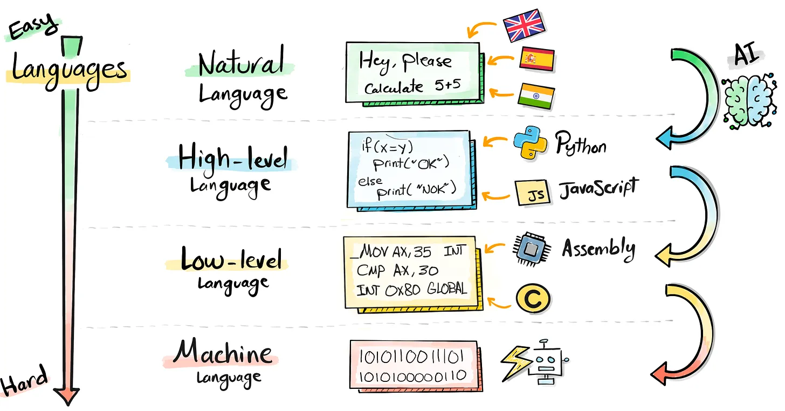

# Programming Languages
A computer ultimately executes only very simple operations. Humans, by contrast, 
think  in rich, ambiguous concepts. Programming languages exist to bridge this gap:  
they allow humans to express precise procedures in a form that machines can execute.

Every programming language is a compromise between various factors, including:
    - Abstractness: how much detail is hidden from the programmer
    - Readability: how easily humans can understand the code
    - Expressiveness: how easily we can represent complex ideas
    - Performance: how efficiently the computer can execute the program
    - Portability: how easily code can run on different hardware and operating systems

Understanding languages conceptually matters more than mastering any single one. 
From the low-level assembly languages that interact directly with hardware to high-level 
languages that abstract away fine details, all languages share common principles. The
goal for any programmer is to understand these principles so they can use the 
appropriate tools for the task at hand (instead of being married to a single language).

## The Hierarchy of Languages
It is useful to think of languages as forming a hierarchy, ordered by how close they 
are to natural human language (i.e., their level of abstraction). 
{align=center}

### Natural Language
Natural language is flexible, contextual, and deeply ambiguous. This makes it ideal 
for communication between humans and unsuitable for execution by machines.

??? abstract "example"

    Consider the instruction:
    
    “Plot the data and clean it up.”
    
    A human scientist can interpret this. A computer cannot.

### High-Level Programming Languages
High-level languages allow you to express ideas in a compact, readable form while  
hiding many implementation details. These languages are designed to help you think more
about what you want to do, and less about how the hardware does it.

Python and MATLAB fall squarely in this category. Although they differ syntactically,
they share similar conceptual foundations.

### Low-Level Programming Languages
Low-level languages sit closer to the hardware. This additional control comes at the 
cost of verbosity and cognitive load. Low-level languages are essential when  
performance, timing, or hardware interaction is critical, but they are rarely the 
best place to start reasoning about a scientific problem.

### Machine Code
At the bottom of the hierarchy is machine code: sequences of binary instructions  
executed directly by the processor. Machine code is maximally precise and maximally  
unreadable. Every program, regardless of the language it is written in, is 
eventually translated into machine code before execution.